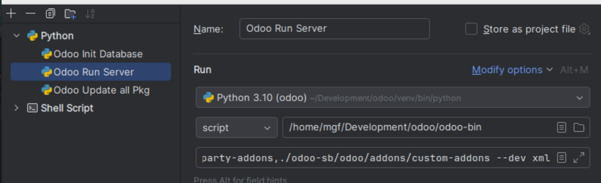

# HTL STP

## Installation

```commandline
git clone https://github.com/odoo/odoo.git

cd odoo

git clone https://gitlab.sb.solutions/odoo/odoo-enterprise.git
git clone https://gitlab.sb.solutions/odoo/htlstp.git
```

## Run Configurations 
Virtual Environment


Script Parameters
```
--db_host
localhost
-d
odoo
-r
odoo
-w
password
--addons-path
./odoo-enterprise,./addons,./htlstp/addons
--dev
xml
```

